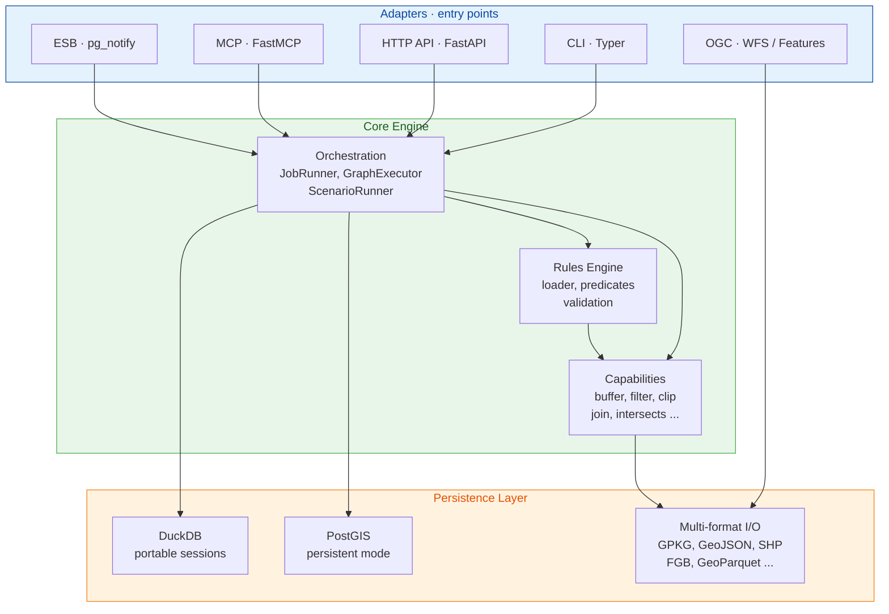
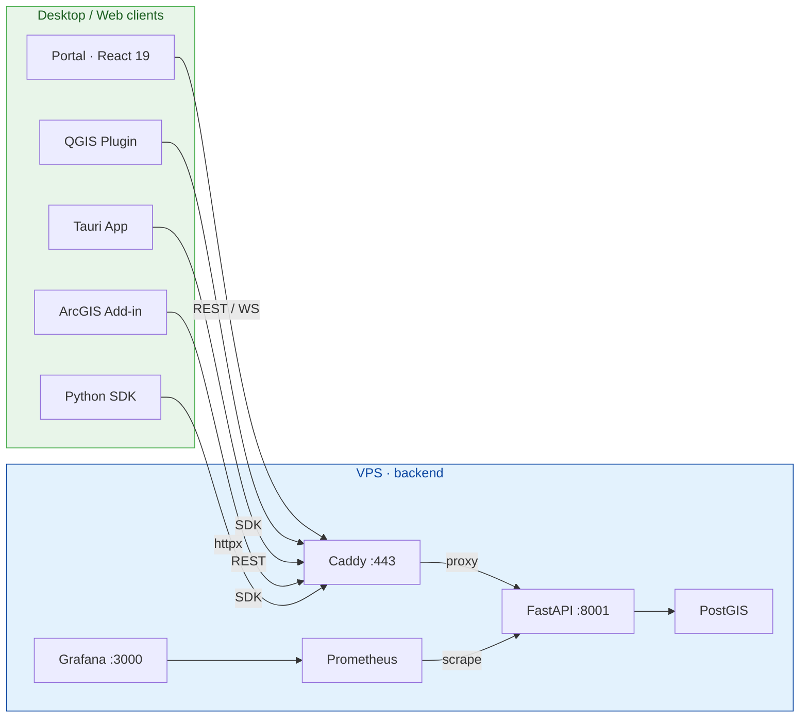

<p align="center">
  
</p>

<p align="center">
  <strong>Modular, client-agnostic geospatial engine with business rules, triggers, and dual operating modes.</strong>
</p>

[](https://pypi.org/project/gispulse/)
[](https://pypi.org/project/gispulse/)
[](LICENSE)
[](https://python.org)
[](https://github.com/imagodata/gispulse/actions/workflows/ci.yml)
[](https://codecov.io/gh/imagodata/gispulse)
[](https://github.com/imagodata/gispulse/discussions)
[](https://imagodata.github.io/gispulse/)

## What is GISPulse?

GISPulse is a **rules-as-config spatial processing engine**. Instead of writing custom scripts for each geospatial workflow, you define declarative rules in JSON — buffer zones, spatial joins, filtering, clipping — and GISPulse executes them on any spatial dataset through any entry point.

**The problem it solves:** GIS teams repeatedly build one-off scripts to process spatial data. These scripts are fragile, hard to share, and tied to a single tool. GISPulse replaces them with a reusable engine where rules are configuration, not code.

**Who it's for:**
- **GIS analysts** who want to automate repetitive spatial processing without writing Python scripts
- **Data engineers** who need reliable, reproducible geospatial pipelines
- **Development teams** building spatial applications who need a backend engine with rules, triggers, and multi-format I/O
- **Organizations** managing spatial datasets across multiple tools (QGIS, ArcGIS, web portals) from a single source of truth

**Key differentiators:**
- **Rules-as-config** — define spatial operations in JSON, version them in Git, share across teams
- **Client-agnostic** — same engine behind CLI, REST API, MCP (LLM agents), OGC services, and event bus
- **Dual mode** — run locally with DuckDB (zero setup) or server-side with PostGIS (live triggers, shared state)
- **Multi-client** — web portal, QGIS plugin, ArcGIS add-in, Tauri desktop app, Python SDK

> **Documentation:** [https://imagodata.github.io/gispulse/](https://imagodata.github.io/gispulse/)

## Vision

A central geospatial engine that executes business rules, spatial processing, and triggers on spatial datasets — regardless of the entry point (CLI, HTTP API, MCP, OGC, event bus).

### Two operating modes

- **Portable (session)** — DuckDB + local file I/O (GPKG, GeoJSON, Shapefile, etc.). No external database needed.
- **Persistent (server)** — PostGIS central, live triggers via `pg_notify`, event-driven pipelines.

## Installation

```bash
# Recommended: pipx (isolated CLI, no system Python pollution)
pipx install gispulse

# Or pip into a virtualenv / per-project environment
pip install gispulse

# With PostGIS + API extras
pipx install "gispulse[postgis,api]"

# With all extras (PostGIS, API, raster, network, S3, scheduling)
pipx install "gispulse[all]"

# Pro meta-package (PostGIS + API + Redis + S3 + scheduling)
pipx install gispulse-pro

# Via Homebrew (macOS)
brew tap imagodata/gispulse
brew install gispulse

# Via Scoop (Windows)
scoop bucket add gispulse https://github.com/imagodata/gispulse
scoop install gispulse

# Via install script (Linux / macOS)
curl -fsSL https://raw.githubusercontent.com/imagodata/gispulse/main/scripts/install.sh | bash
```

> **Note for macOS Sonoma+ / Debian recent / Ubuntu 23.04+** users — a global `pip install gispulse` may fail with `error: externally-managed-environment` (PEP 668). Use `pipx` (above) or activate a virtualenv first. `pipx` also keeps GISPulse isolated from any other `geopandas` / `pyproj` install on your system. Install pipx via [the official guide](https://pipx.pypa.io/stable/installation/).

## Quick start

```bash
# Scaffold a project
gispulse init my-project && cd my-project

# Run a rules pipeline on a spatial file
gispulse run parcels.gpkg --rules rules.json --output result.gpkg

# Inspect a file
gispulse info parcels.gpkg

# Launch the web portal
gispulse portal

# Launch the embedded viewer
gispulse serve parcels.gpkg

# Check system health
gispulse doctor
```

### Run the portal locally

```bash
# Install the CLI plus the bundled SPA workbench
pipx install gispulse-portal

# Start the local engine and open the browser at localhost:8001/portal
gispulse portal
```

For headless runs (no SPA), use `gispulse engine` instead. See:
[Running the Portal locally](https://imagodata.github.io/gispulse/en/guide/portal-local) ·
[Running the engine](https://imagodata.github.io/gispulse/en/guide/engine).

### Docker (development)

```bash
docker compose up
```

| Service | Port | Description |
|---|---|---|
| `postgis` | 5433 | PostGIS 16 spatial database |
| `gispulse-api` | 8001 | FastAPI backend with hot-reload |
| `portal` | 5173 | React web portal (Vite dev server) |

### Docker (local team — no source mounts)

```bash
docker compose -f docker-compose.local.yml up -d
```

| Service | Port | Description |
|---|---|---|
| `postgis` | 5433 | PostGIS 16 (healthcheck, persistent volume) |
| `gispulse-api` | 8001 | FastAPI backend (configurable via `GISPULSE_PORT`) |

### Production VPS

```bash
cd deploy && cp .env.example .env  # edit values
docker compose -f docker-compose.prod.yml up -d
```

| Service | Port | Description |
|---|---|---|
| `postgis` | — | PostGIS 16 (internal only) |
| `gispulse-api` | 8001 | FastAPI backend, 4 workers |
| `caddy` | 80/443 | Reverse proxy, auto-TLS (Let's Encrypt) |
| `prometheus` | — | Metrics scraping (15s interval) |
| `grafana` | 3000 | Monitoring dashboards |
| `pg-backup` | — | Daily PostgreSQL backups (30d retention) |

## CLI

```bash
gispulse init [dir]                    # Scaffold a new project
gispulse run <file> --rules <r>        # Execute a rules pipeline
gispulse validate <rules.json>         # Dry-run rule validation
gispulse info <file>                   # Inspect spatial file metadata
gispulse layers <file>                 # List layers in a multi-layer file
gispulse formats                       # Print supported read/write formats
gispulse capabilities                  # List registered capabilities
gispulse serve <file>                  # Launch embedded spatial viewer
gispulse portal                        # Launch the web portal
gispulse doctor                        # System diagnostics
gispulse engine [start|stop|status]    # Manage local sidecar engine
gispulse jobs [list|status|cancel]     # Manage async jobs via HTTP API
gispulse update [--check] [--force]    # Check for updates / self-update
gispulse telemetry [--status|--enable|--disable]  # Manage opt-in telemetry
gispulse triggers run|validate|list    # Standalone trigger runtime (Mode 1, GPKG)
```

### Standalone trigger runtime

Since v1.2.1, `gispulse triggers` runs a YAML-configured trigger pipeline directly against a local GeoPackage — no FastAPI server needed. Useful for cron, on-prem ETL, QGIS sidecars.

```bash
gispulse triggers validate --config triggers.yaml
gispulse triggers run --config triggers.yaml --once
gispulse triggers run --config triggers.yaml --watch
```

See [`docs/TRIGGERS_GUIDE.md`](docs/TRIGGERS_GUIDE.md#standalone-cli-mode) and [`examples/cli/triggers.yaml`](examples/cli/triggers.yaml).

## Tiers

GISPulse uses a tier system controlled by the `GISPULSE_TIER` environment variable.

| Feature | Community (free) | Pro | Enterprise |
|---|---|---|---|
| DuckDB engine | Yes | Yes | Yes |
| PostGIS / Hybrid engine | — | Yes | Yes |
| ESB triggers (pg_notify) | — | Yes | Yes |
| DAG executor | — | Yes | Yes |
| Visual pipeline editor | — | Yes | Yes |
| Raster / Network extras | — | Yes | Yes |
| Monitoring (Prometheus) | — | Yes | Yes |
| RBAC / Multi-project | — | — | Yes |
| SSO (SAML / OIDC) | — | — | Yes |
| White-label / Clustering | — | — | Yes |

Pro and Enterprise require a `GISPULSE_LICENSE_KEY`. See `pricing.yml` for full details.

## Integrations

GISPulse exposes its data and live events through standard protocols so any GIS client can consume them — no custom plugin required.

### What you can do today (v1.2)

| Client | Mode | Setup |
|---|---|---|
| **QGIS** | Drag-and-drop GPKG output | Run a pipeline → drop the resulting `.gpkg` into QGIS |
| **QGIS** | Live OGC API Features / WFS | Add a Vector Layer → `https://server/wfs` or `https://server/ogc/features` |
| **QGIS / MapLibre / deck.gl / ArcGIS Online** | MVT tiles (PostGIS) | `GET /tiles/{id}/tilejson.json` returns a TileJSON 3.0 doc with the tileset URL, bounds, vector layers schema |
| **ArcGIS Pro** | OGC API Features | "Add Data → OGC API Features" with the GISPulse endpoint URL |
| **ArcGIS GeoEvent / Zapier** | Webhook out (incoming v1.2.x) | Trigger fires → `POST` to your webhook URL |
| **Custom JS apps** | Live events via WebSocket | `wss://server/ws/events?topics=trigger_fired&trigger_id=<uuid>` (filter by topic, trigger, or table) |

### What's coming v1.3+

- **QGIS plugin** — native dataset browser, job runner, OGC/PostGIS/MVT layer wizard
- **ArcGIS REST connector** — first-class client for ArcGIS Online and Server feature services
- **JS SDK** — `@gispulse/sdk-core` published on npm with typed APIs for jobs, rules, triggers, and live events
- **MVT for DuckDB** — server-side vector tile generation without PostGIS

> See [`docs/INTEGRATION_MATRIX.md`](docs/INTEGRATION_MATRIX.md) for the full client × mode × version compatibility matrix.

**Step-by-step integration tutorials** (no plugin install required) :
- [QGIS via OGC / MVT / PyQGIS](https://imagodata.github.io/gispulse/integrations/qgis)
- [ArcGIS Pro / Online / GeoEvent (in & out)](https://imagodata.github.io/gispulse/integrations/arcgis)
- [MapLibre GL JS / deck.gl with live WS](https://imagodata.github.io/gispulse/integrations/maplibre)

### Concurrency note — SpatiaLite

When GISPulse runs in **portable mode** (DuckDB / GPKG / SpatiaLite), the underlying SQLite engine enforces **a single writer at a time**. Concurrent rule executions and triggers serialize on the database file lock — this is by design for filesystem-based GPKG, not a GISPulse limit. For multi-writer workloads (parallel jobs, live triggers under load), switch to the **persistent mode (PostGIS)** which is the supported production path.

## Architecture



### Project structure

```
gispulse/
  gispulse/       # Package entry point, CLI (Typer)
  core/           # Domain models: Dataset, Rule, Job, Trigger, Scenario, Layer
  capabilities/   # Spatial operations: vector, raster, network, PostGIS SQL
  rules/          # Rule engine, loader, predicates, validation
  orchestration/  # Job runner, DAG graph executor, scenario runner
  persistence/    # DuckDB engine, PostGIS engine, tier gating, multi-format I/O
  adapters/
    http/         # FastAPI — datasets, rules, jobs, projects, OGC Features, MVT tiles, rate limiting
    mcp/          # FastMCP — LLM agent facade
    ogc/          # WFS/OGC API Features client with GeoParquet cache
    esb/          # Event bus — pg_notify triggers, circuit breaker, DLQ
  catalog/        # GIS data catalog (projections, basemaps, WMS/WFS flux, open data)
  portal/         # React 19 web app — visual pipeline editor, map, table views
  viewer/         # React 19 embedded spatial file viewer (deck.gl)
  sdk/            # Python SDK client library (httpx + pydantic)
  clients/
    qgis/         # QGIS plugin — dataset browser, jobs, OGC/PostGIS/MVT layers
    desktop/      # Standalone Tauri 2 app — React + MapLibre GL JS
    arcgis/       # ArcGIS Pro add-in — dockpanes + GP tools
  deploy/         # Production VPS: docker-compose, Caddy, Prometheus, Grafana, backups
  packaging/      # Homebrew formula, Scoop manifest, update scripts
  scripts/        # Installation scripts
  docs-site/      # VitePress documentation site
  tests/          # 175 test files — 3,800+ unit and integration tests
  examples/       # Sample datasets (GPKG), rules (JSON), and helper scripts
  docs/           # Architecture docs, API reference, ADRs
```

## Capabilities

**117 registered capabilities** across 18 categories. Full reference: [capabilities guide](https://imagodata.github.io/gispulse/guide/capabilities).

### Vector — geometry & analysis

`buffer` `union` `clip` `intersects` `spatial_join` `dissolve` `centroid` `envelope` `reproject` `simplify` `convex_hull` `concave_hull` `alpha_shape` `voronoi_polygons` `delaunay_triangulation` `symmetric_difference` `vector_diff` `grid_create` `hexgrid_create` `polygonize` `line_merge` `line_substring` `offset_curve` `snap_to_grid` `make_valid` `chaikin` `boundary` `assign_projection`

### Vector — overlay & combine

`overlay_intersection` `overlay_union` `overlay_difference` `merge_layers`

### Vector — layer manipulation

`force_geometry_type` `singleparts_to_multipart` `multipart_to_singleparts` `extract_holes` `extract_segments` `extract_vertices` `densify_vertices` `pivot` `unpivot` `classify_by_ring`

### Vector — attributes, filters, calculations

`filter` `calculate` `normalize` `area_length` `nearest_neighbor` `spatial_aggregate` `spatial_weights` `od_matrix` `attribute_join` `add_z` `add_m` `attribute_logic_ops`

### Classification & styling

`classify` `classify_categorical` `head_tail_breaks` `choropleth` `bivariate_choropleth` `graduated_size` `continuous_ramp` `kde_heatmap`

### Clustering & spatial statistics

`cluster_kmeans` `cluster_dbscan` `cluster_hdbscan` `morans_i` `getis_ord_g`

### Temporal

Date/time-aware operations on attributes — windowing, deltas, period extraction.

### Data quality & topology

`topology_check` `make_valid` `duplicate_geometry` `attribute_validation` `completeness_check` `connectivity_check` `polygon_fix_gaps` `polygon_fix_overlaps` `polygon_remove_slivers` `polygon_snap_borders`

### Network (optional: `pip install -e ".[network]"`)

`shortest_path` `isochrone` `network_allocation` `mst` `network_snap_endpoints` `network_node_lines` `network_extend_dangles` `network_remove_pseudo_nodes` `network_remove_duplicates`

### Raster (optional: `pip install -e ".[raster]"`)

`zonal_stats` `change_detection` `raster_clip` `raster_merge` `raster_reproject` `ndvi`

### 3D pointcloud (optional: `pip install -e ".[pointcloud]"`)

`pointcloud_load` (LAS/LAZ) `pointcloud_classify` `pointcloud_zonal_stats` `pointcloud_grid`

### SQL pass-through

`postgis_sql` — parameterised SQL on a PostGIS session (Pro tier, auth-gated with capability blocklist).

See the [capabilities guide](https://imagodata.github.io/gispulse/guide/capabilities) for parameter reference.

## Supported formats

**Read:** GPKG, GeoJSON, Shapefile, FlatGeobuf, GML, KML, DXF, SQLite, FileGDB, GeoParquet, CSV/TSV, XLSX

**Write:** GPKG, GeoJSON, Shapefile, FlatGeobuf, GeoParquet, CSV

## API adapters

| Adapter | Protocol | Description |
|---|---|---|
| **HTTP** | REST / WebSocket | Full CRUD for datasets, rules, jobs, projects, scenarios, triggers. OGC API Features endpoint. MVT tile server. Prometheus `/metrics` with HTTP request metrics. Rate limiting (300/min, Redis-backed optional). Timing-safe auth, CSP headers, SSRF protection. |
| **MCP** | Model Context Protocol | LLM agent facade — list capabilities, create/validate rules, load datasets, run jobs. |
| **OGC** | WFS 2.0 / OGC API Features | Client with pagination and GeoParquet disk cache (1h TTL). |
| **ESB** | pg_notify | PostgreSQL trigger functions, event routing, circuit breaker, dead letter queue. |

## Client-server architecture



GISPulse supports a split architecture: backend hosted on a VPS, frontends installed locally.

### Python SDK

```bash
pip install ./sdk
```

```python
from gispulse_sdk import GISPulseClient

with GISPulseClient("https://gispulse.example.com", api_key="sk-...") as client:
    datasets = client.datasets.list()
    job = client.jobs.run_and_wait(JobCreate(name="buffer"))
    ogc_url = client.ogc.items_url("parcels")
    tiles = client.tiles_url("parcels")
```

10 endpoint modules: `datasets`, `projects`, `rules`, `triggers`, `jobs`, `scenarios`, `sessions`, `ogc`, `catalog`, `capabilities`. Async client, WebSocket live events, SSE streaming.

### QGIS plugin

```bash
cd clients/qgis && python build_plugin.py    # -> gispulse_qgis.zip
# Install via QGIS > Plugin Manager > Install from ZIP
```

- Connection dialog (server URL + API key, test button)
- Dataset browser dock with 3 loading modes: OGC API Features, PostGIS session, MVT tiles
- Job execution dock with result auto-loading as QGIS layer
- All SDK calls run in QThread (non-blocking UI)

### Standalone desktop app (Tauri)

```bash
cd clients/desktop
npm install && npm run tauri:dev         # dev mode
npm run tauri:build                      # .msi / .dmg / .AppImage
```

React 19 + Tauri 2 + MapLibre GL JS + Tailwind CSS 4. Connection setup with splash screen, dataset browser with drag-and-drop import, job panel, MVT tile map.

### ArcGIS Pro add-in

```bash
cd clients/arcgis && python makeaddin.py   # -> gispulse_arcgis.esriaddin
```

- Dockpanes for datasets and jobs
- 3 geoprocessing tools: Upload Dataset, Run Job, Run Scenario (usable in Model Builder)
- Native OGC API Features + PostGIS session layer loading

## Data flow — rules pipeline


## Portal

React 19 web application (pgAdmin-style — FastAPI backend + SPA, runs via `gispulse portal`).

Stack: React 19, TypeScript, Vite, Tailwind CSS 4, shadcn/ui, Zustand, TanStack Query, MapLibre GL JS, XyFlow/ReactFlow v12.

### Workspaces

5 workspaces via React Router (`/projects/:projectId/:workspace`):

| Workspace | Description |
|---|---|
| **Explorer** | Dataset/layer tree, rules, triggers panels |
| **Map** | MapLibre GL map with SQL console and feature inspector |
| **Workflows** | Visual DAG pipeline editor (ReactFlow) |
| **Catalog** | GIS data catalog with domain/type filtering |
| **Data** | Tabular feature exploration with schema browser |

### Key features

- **Node editor** — visual DAG pipeline builder, 9 node types, NodePalette with 6 categories, inline inspector, "Run this node" / "Save as Rule" actions
- **Map view** — MapLibre GL, layer tree (visibility, color picker, groups), basemap grid (OSM/CARTO/IGN), bookmarks, legend, cursor coordinates
- **Command palette** — Ctrl+K fuzzy search across datasets/rules/layers
- **Dark mode** — full dark/light toggle, persisted, respects `prefers-color-scheme`
- **Scenarios panel** — 4 tabs (Flows/Rules/Triggers/History) with dirty-state confirmation
- **Catalog workspace** — domain/filter sidebar, card grid, metadata inspector, favorites
- **Trigger builder** — cron, attribute predicate, DML triggers with spatial operations
- **Upload/import** — drag-and-drop or URL, multi-layer GPKG/GeoJSON/Shapefile
- **Export** — multi-layer GPKG with QGIS-compatible QML styles
- **Keyboard shortcuts** — workspace nav (1-5), command palette (Ctrl+K), inspector (Ctrl+I)
- **Design system** — oklch neutral palette + blue accent, Geist Variable font, CSS custom properties

**Portal API** (`/api/portal/*`): upload, features (bbox/limit/simplify), import-url, export-gpkg, rename, delete, capabilities, feature update, SQL execution, relation browsing.

## Telemetry

GISPulse collects anonymous, opt-in telemetry. No file paths, data content, IP addresses, or dataset names are ever collected. Only aggregated usage signals (engine mode, capability names, command duration, OS/arch).

```bash
gispulse telemetry --status    # Check current setting
gispulse telemetry --disable   # Opt out
GISPULSE_TELEMETRY=0           # Disable via env var (CI-friendly)
```

## Project status

| Module | Status | Notes |
|---|---|---|
| Core models | Done | Dataset, Layer, Rule, Job, Artifact, Scenario, Trigger |
| Vector capabilities | Done | 117 capabilities across 18 categories (geometry, overlay, attributes, classification, clustering, topology, temporal, 3D pointcloud, network), registry + strategy pattern |
| Rules engine | Done | JSON rules, sequential execution, predicates |
| DuckDB session | Done | <100ms startup, GPKG native |
| Multi-format I/O | Done | 13+ read formats, pyogrio |
| Tier gating | Done | Community / Pro / Enterprise, license key validation |
| Rate limiting | Done | 300/min default, Redis-backed optional |
| CLI | Done | 14 commands: init, run, validate, info, layers, formats, capabilities, serve, portal, doctor, engine, jobs, update, telemetry |
| Portal UI | Done | React 19, 5 workspaces, node editor, map, catalog, dark mode |
| Portal API | Done | FastAPI, 27 routers, 100+ endpoints |
| Python SDK | Done | httpx + pydantic, 10 endpoint modules, async client, WebSocket/SSE |
| QGIS plugin | Done | Dataset browser, jobs, OGC/PostGIS/MVT layer factories |
| Tauri desktop app | Done | Tauri 2 + React 19 + MapLibre GL JS, splash screen, file import |
| ArcGIS Pro add-in | Done | Dockpanes, 3 GP tools |
| PostGIS + ESB | Done | PostGIS adapter, pg_notify triggers, circuit breaker, DLQ |
| VPS deploy | Done | Caddy TLS, Prometheus, Grafana, pg-backup |
| Viewer | Done | deck.gl spatial viewer via `gispulse serve` |
| Telemetry | Done | Opt-in, privacy-first, non-blocking |
| Packaging | Done | Homebrew, Scoop, install script, release workflow |
| Docs site | Done | VitePress, local search, edit links |
| Tests | Done | 175 test files, 3,800+ tests, 72% overall coverage (85% router coverage) |
| Security | Done | Timing-safe auth, CSP headers, SSRF protection, rate limiting, RBAC |
| Observability | Done | Prometheus `/metrics`, structlog, trace IDs, Grafana dashboards |
| MCP facade | Planned | FastMCP |
| Raster/network | Planned | Optional extras |

## Documentation

**Live docs: [https://imagodata.github.io/gispulse/](https://imagodata.github.io/gispulse/)**

Covers installation, CLI reference, rules syntax, capabilities, supported formats, engines, deployment, REST API, SDK, and plugin development.

```bash
# Run docs locally
cd docs-site
npm install && npm run dev    # Local dev server
npm run build                 # Static site generation
```

Built with VitePress.

## Development

```bash
pip install -e ".[dev]"     # Install with dev dependencies
make test                   # Full test suite (3,800+ tests)
make lint                   # ruff check
make format                 # ruff format
pre-commit install          # Install git hooks (ruff, secret detection)
```

## Codebase stats

| Language | Files | Lines |
|---|---|---|
| Python | ~470 | ~105k |
| TypeScript/React | ~274 | ~51k |
| **Tests** | **175 files** | **3,800+ tests** |

## Contributing

See [CONTRIBUTING.md](CONTRIBUTING.md). Python 3.10+, PEP 8 via ruff, type hints, tests required.

## Related projects

- **FilterMate** — spatial preparation, filtering, and export capabilities
- **FibreFlow** — FTTH design and calculation pipelines

## License

This project is licensed under the [GNU Affero General Public License v3.0 or later](LICENSE) (AGPL-3.0-or-later).
